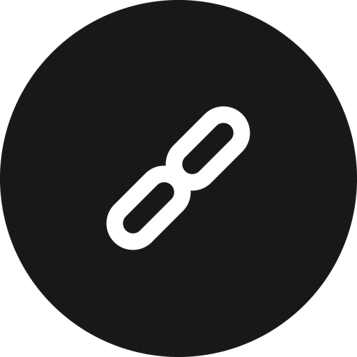
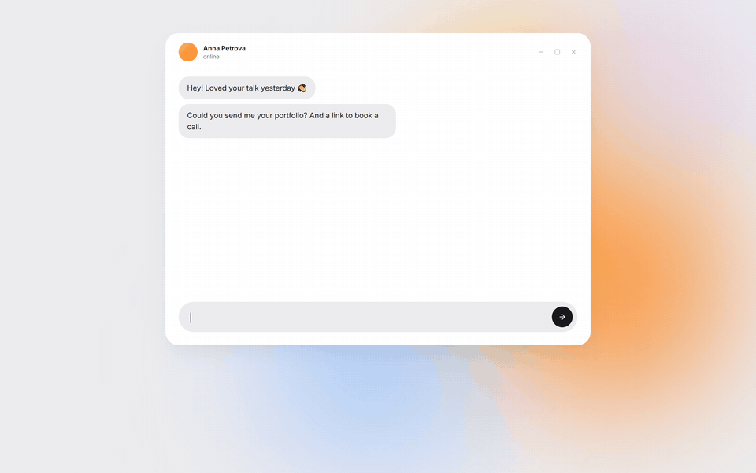
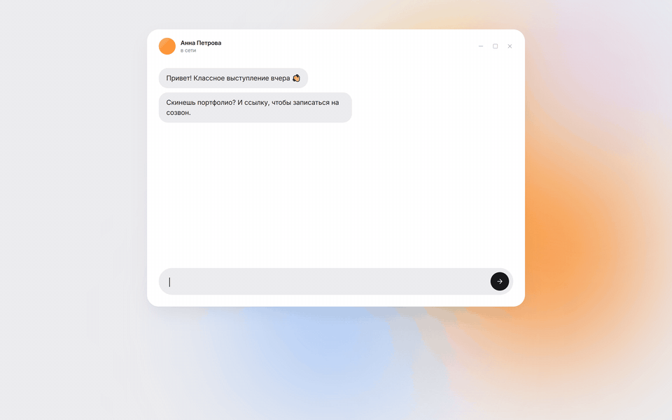

<div align="center">



# Linky

**Your links, one keystroke away.**

Press <kbd>Ctrl</kbd> + <kbd>Alt</kbd> + <kbd>V</kbd> in any text field, pick a link, and it's pasted right where you were typing.

[Download for Windows](https://github.com/tonybmleoy-crypto/linky/releases/latest) · [Download for macOS](https://github.com/tonybmleoy-crypto/linky/releases/latest) · [Русский](#по-русски)



</div>

## What it does

Linky lives in the tray (menu bar on macOS). Save the links and replies you send all the time — portfolio, booking link, GitHub, a polite "I'll get back to you" — and paste them into any app without hunting through tabs.

- **Quick menu at your cursor** — fuzzy search, folders (<kbd>Tab</kbd>), quick keys <kbd>1</kbd>–<kbd>9</kbd>
- **Pastes for you** — focus goes back to the app you were in and the link lands at the caret
- **Your clipboard stays yours** — whatever you had copied comes back after pasting
- **Learns your habits** — frequent and recent snippets float to the top
- **Private by design** — no account, no cloud; everything lives in one JSON file on your computer
- Light & dark themes, English & Russian, Windows 10+ and macOS 12+

## How it's built

| | |
|---|---|
| Shell | Electron 44, electron-vite, electron-builder (NSIS / dmg) |
| UI | React 19, TypeScript, Tailwind CSS 4, design tokens mirrored from Figma |
| Pasting | WinAPI (`keybd_event`, `SetForegroundWindow`) on Windows and CoreGraphics events on macOS, called through [koffi](https://koffi.dev) — no native compilation |
| Data | JSON with atomic writes, validated with zod, versioned with migrations |
| Quality | Vitest unit tests, visual smoke screenshots, GitHub Actions builds for both platforms |

Architecture notes: [docs/ARCHITECTURE.md](docs/ARCHITECTURE.md). The demo above is rendered frame by frame from the app's real components (`site/src/demo`, `scripts/render-demo.cjs`).

## Development

```bash
npm install
npm run dev          # app with hot reload
npm test             # unit tests
npm run build:win    # Windows installer → dist/
npm run site:dev     # landing page
npm run demo:render  # re-render the demo videos
```

macOS builds run on GitHub Actions (`.github/workflows/release.yml`); push a `v*` tag to draft a release.

## По-русски

Linky — маленькое приложение для Windows и macOS: сохраните ссылки и ответы, которые отправляете постоянно, нажмите <kbd>Ctrl</kbd> + <kbd>Alt</kbd> + <kbd>V</kbd> в любом поле ввода, выберите запись — и она вставится туда, где стоит курсор. Интерфейс на русском включается автоматически.


