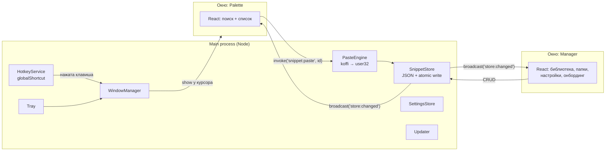
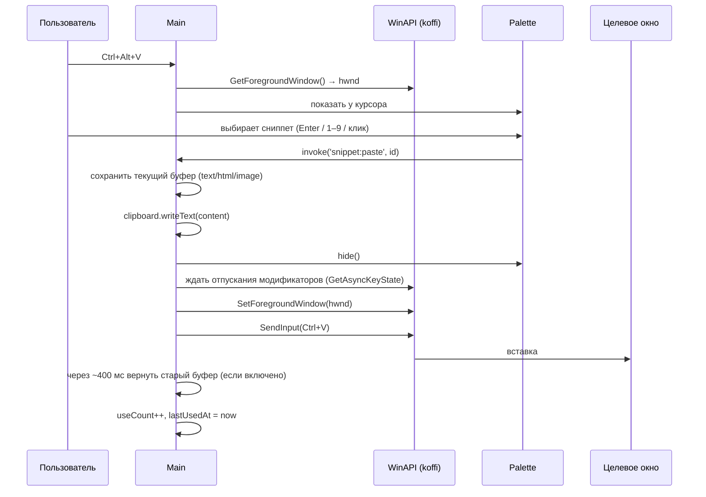

# Linky — архитектура

> Десктопное приложение для быстрой вставки сохранённых ссылок и фрагментов текста.
> Нажимаешь горячую клавишу в любом поле ввода, выбираешь нужное, и оно вставляется туда, где стоит курсор.

Статус: черновик v0.1. Старый прототип на C# лежит в `prototype/` как эталон поведения.

---

## 1. Продукт в одном абзаце

**Linky** живёт в трее. По `Ctrl+Alt+V` у курсора появляется палитра (как Spotlight или Raycast) со списком сниппетов. Сниппетами называем всё, что сохранено: ссылки и куски текста. Над списком строка поиска, слева номера 1–9, вверху закреплённые и часто используемые. После выбора палитра исчезает, а текст вставляется в то приложение, где ты был. Пополнять и разбирать коллекцию можно в отдельном окне-менеджере: там папки, редактирование и настройки.

### Что входит в MVP
| Есть в v1.0 | Позже |
|---|---|
| Палитра по горячей клавише, вставка в активное поле | Переменные в сниппетах: `{date}`, `{clipboard}`, курсор |
| Поиск с нечётким совпадением и ранжированием по частоте | Синхронизация между устройствами (Pro) |
| Папки, закрепление, клавиши 1–9 | Наборы: вставить сразу несколько ссылок |
| Добавление «из буфера» прямо из палитры | Импорт и экспорт, шаринг набора по ссылке |
| Менеджер: CRUD, drag & drop, настройки | macOS |
| Светлая и тёмная тема, онбординг | Монетизация (Pro) |
| Автозапуск, установщик, автообновления | |

---

## 2. Стек

| Слой | Выбор | Почему |
|---|---|---|
| Оболочка | **Electron** | Ничего не нужно ставить на диск C, кроссплатформенность, зрелая экосистема |
| Сборка | **electron-vite** + **Vite** | Одна конфигурация для main, preload и renderer, HMR |
| UI | **React 19 + TypeScript** | |
| Стили | **Tailwind CSS** + CSS-переменные для токенов темы | Быстро, а дизайн-токены задаются в одном месте |
| Компоненты | **Radix UI** (примитивы) | Доступность, фокус и клавиатура из коробки, свой внешний вид |
| Анимации | **Motion** (framer-motion) | Появление палитры, перестановка списков |
| Состояние в UI | **Zustand** | Маленький и простой |
| Поиск | **Fuse.js** + собственный «frecency»-скоринг | |
| Валидация данных | **Zod** | Схема хранилища и IPC-сообщений |
| Нативные вызовы WinAPI | **koffi** (FFI) | Готовые бинарники, **не нужен компилятор C++** |
| Упаковка | **electron-builder** → NSIS-установщик | |
| Обновления | **electron-updater** + GitHub Releases | Бесплатно |
| Тесты | **Vitest** (логика), **Playwright** (e2e, позже) | |
| Качество | ESLint + Prettier, `tsc --noEmit` в CI (GitHub Actions) | |

**Сознательно не берём:**
- SQLite (better-sqlite3): это нативный модуль, его пришлось бы компилировать. Для сотен или даже тысяч записей хватит JSON.
- robotjs и nut.js: первый заброшен, второй стал платным. Нам нужно ровно три вызова WinAPI, их делаем через koffi.

---

## 3. Процессы и окна



### Main process — единственный источник правды
- **WindowManager** держит два окна.
  - **Palette**: без рамки, прозрачное, поверх всех окон, без иконки в панели задач. Создаётся **один раз при старте** и потом только прячется и показывается, поэтому открывается мгновенно (<50 мс). Позиция у курсора с проверкой границ экрана; если курсор у края, окно сдвигается внутрь.
  - **Manager**: обычное окно с кастомным заголовком (`titleBarStyle: hidden` + `titleBarOverlay`). Создаётся при первом открытии.
- **HotkeyService** регистрирует горячую клавишу из настроек и сообщает о конфликте (`register` возвращает `false`), чтобы UI это показал.
- **SnippetStore / SettingsStore**: чтение и запись данных, валидация через Zod, миграции схемы.
- **PasteEngine**: вставка (см. раздел 5).
- **Tray**: меню в трее, двойной клик открывает Manager.
- **Updater**: проверяет обновления при старте и раз в 6 часов.

### Preload
Пробрасывает в окно через `contextBridge` один **типизированный** объект `window.linky` с методами из IPC-контракта. Никакого прямого доступа к Node из UI.

### Renderer
Одно Vite-приложение с двумя точками входа, `palette.html` и `manager.html`. Общие компоненты, тема и стор лежат в `src/renderer/shared`.

---

## 4. Модель данных

Файл `%APPDATA%/Linky/library.json`:

```ts
interface Library {
  version: 1;                 // для миграций
  snippets: Snippet[];
  folders: Folder[];
}

interface Snippet {
  id: string;                 // nanoid
  title: string;              // может быть пустым → показываем content
  content: string;            // то, что вставляется
  kind: 'link' | 'text';      // определяется автоматически, влияет на иконку и превью
  folderId: string | null;
  pinned: boolean;
  order: number;              // ручной порядок внутри папки
  useCount: number;
  lastUsedAt: number | null;  // для frecency
  createdAt: number;
  updatedAt: number;
  meta?: { faviconUrl?: string; siteName?: string }; // подтягивается для ссылок, опционально
}

interface Folder {
  id: string;
  name: string;
  icon?: string;              // эмодзи или имя иконки
  color?: string;             // токен из палитры
  order: number;
}
```

Файл `settings.json`:

```ts
interface Settings {
  version: 1;
  hotkey: string;                       // 'CommandOrControl+Alt+V'
  theme: 'system' | 'light' | 'dark';
  launchAtLogin: boolean;
  palettePosition: 'cursor' | 'center';
  restoreClipboard: boolean;            // вернуть прежний буфер после вставки
  pasteMode: 'paste' | 'copy';          // вставить сразу или только скопировать
  fetchFavicons: boolean;               // приватность: сеть по желанию
  onboardingDone: boolean;
}
```

**Надёжность записи:** сначала пишем во временный файл, затем `rename`. Записи идут с задержкой (debounce 300 мс), при выходе всё сбрасывается на диск. Перед миграцией сохраняется копия `library.backup.json`.

**Ранжирование (frecency):** `score = fuzzyScore × w1 + log(1 + useCount) × w2 + recencyDecay(lastUsedAt) × w3`. Закреплённые всегда наверху. При пустом запросе порядок такой: закреплённые → часто используемые → остальные.

---

## 5. PasteEngine: самое тонкое место

Цель: вставить текст в чужое приложение так, как будто пользователь сам нажал `Ctrl+V`.



Интерфейс абстрагирован под будущую поддержку macOS:

```ts
interface PlatformInput {
  captureTarget(): TargetHandle;           // запомнить активное окно
  focus(target: TargetHandle): void;
  sendPaste(): Promise<void>;
  waitModifiersReleased(): Promise<void>;
}
// src/main/platform/win32.ts  — koffi + user32.dll
// src/main/platform/darwin.ts — позже: CGEvent / AppleScript + Accessibility permission
```

**Известные риски:**
- Приложения, запущенные **от администратора**, не принимают ввод от обычного процесса (UIPI). В этом случае сниппет просто остаётся в буфере, а пользователь видит уведомление «Скопировано, нажмите Ctrl+V».
- Восстановление буфера может «опередить» медленное приложение. Поэтому задержка настраивается, а сама функция отключается.
- Горячая клавиша может оказаться занята. Тогда онбординг предлагает выбрать другую.

---

## 6. IPC-контракт

Все каналы описаны в одном файле `src/shared/ipc.ts`, оттуда типы получают и preload, и main.

```ts
// Запрос-ответ (invoke)
'library:get'        () => Library
'snippet:create'     (input: SnippetInput) => Snippet
'snippet:update'     (id, patch) => Snippet
'snippet:delete'     (id) => void
'snippet:reorder'    (folderId, ids[]) => void
'snippet:paste'      (id) => PasteResult      // 'pasted' | 'copied' | 'error'
'snippet:fromClipboard' () => Snippet | null
'folder:*'           ...аналогично
'settings:get' / 'settings:update'
'hotkey:test'        (accelerator) => { ok: boolean; reason?: string }
'palette:hide'       () => void
'app:openManager'    (route?) => void

// События main → окна (send)
'library:changed'    Library
'settings:changed'   Settings
'palette:shown'      { query?: string }   // сброс поиска, фокус в инпут
```

Каждый входящий payload валидируется через Zod в main: renderer считается недоверенным.

---

## 7. Структура репозитория

```
linky/
├─ docs/                     # архитектура, решения (ADR), скриншоты для README
├─ prototype/                # первая версия на C#, только для справки
├─ resources/                # иконки приложения и трея (.ico/.png/.icns)
├─ src/
│  ├─ main/
│  │  ├─ index.ts            # bootstrap, single-instance lock
│  │  ├─ windows/            # palette.ts, manager.ts, positioning.ts
│  │  ├─ services/           # hotkey, paste, tray, updater, autostart
│  │  ├─ store/              # library-store.ts, settings-store.ts, migrations/, atomic-write.ts
│  │  ├─ platform/           # win32.ts (koffi), darwin.ts (позже), index.ts
│  │  └─ ipc/                # регистрация хендлеров
│  ├─ preload/
│  │  └─ index.ts            # contextBridge → window.linky
│  ├─ shared/                # типы, zod-схемы, ipc-контракт, ранжирование (чистые функции)
│  └─ renderer/
│     ├─ palette/            # окно палитры
│     ├─ manager/            # окно менеджера: library, settings, onboarding
│     └─ shared/             # ui-kit, тема, хуки, store (zustand)
├─ tests/                    # vitest для shared/ и store/
├─ electron.vite.config.ts
├─ electron-builder.yml
└─ package.json
```

---

## 8. Безопасность

- `contextIsolation: true`, `sandbox: true`, `nodeIntegration: false` во всех окнах.
- Строгий CSP, никаких удалённых скриптов. Внешние ссылки открываются только через `shell.openExternal` после проверки протокола (`http`, `https`, `mailto`).
- Запросы фавиконок идут только из main и только при включённой настройке.
- Сниппеты лежат локально. Шифрование хранилища и пароли в сниппетах вне скоупа v1, в UI будет предупреждение «не храните здесь пароли».

---

## 9. Сборка и окружение (всё на диске D)

```
ELECTRON_CACHE=D:\.cache\electron
ELECTRON_BUILDER_CACHE=D:\.cache\electron-builder
npm config set cache D:\.cache\npm
```

- `npm run dev` запускает Electron с HMR.
- `npm run build:win` собирает `dist/Linky-Setup-x.y.z.exe`.
- **Подпись кода:** без сертификата Windows SmartScreen покажет предупреждение «Неизвестный издатель». Для портфолио это допустимо. К релизу можно взять Azure Trusted Signing (~$10/мес) или OV-сертификат.

---

## 10. Задел под Pro (без оплаты в v1)

- Модуль `entitlements.ts` с методом `has(feature)`. Пока всегда возвращает `true`.
- Будущие Pro-функции: синхронизация, переменные, наборы, неограниченные папки.
- Позже: лицензионный ключ через Lemon Squeezy License API и офлайн-проверка с кэшем на 7 дней.

---

## 11. План работ

| # | Этап | Результат |
|---|---|---|
| 0 | **Архитектура** | Этот документ |
| 1 | **Дизайн** | Дизайн-токены, макеты палитры, менеджера, настроек и онбординга (светлая и тёмная тема) |
| 2 | Каркас | electron-vite + React + TS + Tailwind, трей, два окна, IPC, хранилище |
| 3 | Палитра | Горячая клавиша, поиск, клавиатурная навигация, PasteEngine |
| 4 | Менеджер | Папки, CRUD, drag & drop, настройки, смена горячей клавиши |
| 5 | Полировка | Онбординг, анимации, пустые состояния, обработка ошибок |
| 6 | Релиз | Установщик, автообновления, иконки, GitHub Actions |
| 7 | Маркетинг | Лендинг, README с GIF-демо, Product Hunt |
| 8 | macOS / Pro | По результатам |

## 12. Открытые вопросы

1. **Название.** Перед публикацией стоит проверить, свободны ли «Linky», домен и имя в GitHub.
2. **Горячая клавиша по умолчанию.** Варианты: `Ctrl+Alt+V` или `Ctrl+Shift+Space`. `Win+…` надёжнее не брать: многие такие сочетания заняты системой.
3. **Только ссылки или любой текст?** В архитектуре заложено «любой текст». В позиционировании можно делать упор на ссылки, это понятнее.
